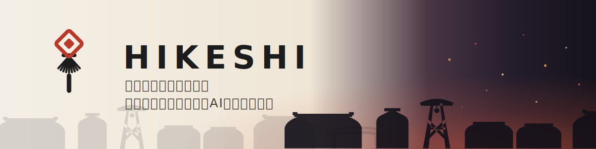
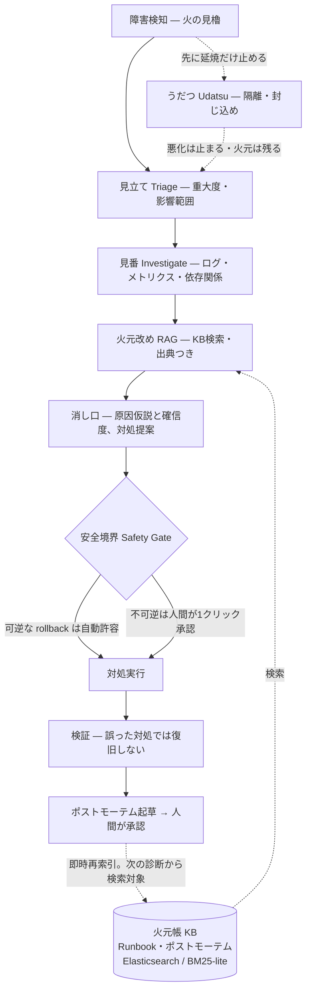

<p align="center">
  
</p>

<h1 align="center">HIKESHI</h1>

<p align="center"><b>江戸の火消しに学ぶ、少人数SREのための自律インシデント対応AIエージェント。</b><br>
AIが自律で調査・判断し、取り返しのつかない操作だけ人間が承認する。</p>

<p align="center">
  
  
  
  
  
  
</p>

<p align="center">
  <a href="https://hikeshi-console-xyvk2c2k6q-uc.a.run.app"><b>🔥 ライブデモを開く</b></a><br>
  <sub>公開デモのため、LLM診断には12秒間隔・日次上限の軽いレート制限があります</sub>
</p>

---

**30秒の体験** — 障害を注入すると、画面全体が夜の火事場へ転調して「出動」の文字が上がる。まず**うだつ**で延焼を止める。AIは**見立て → 見番 → 火元改め → 消し口**と自律調査を進め、その実推論がリアルタイムに流れてくる。提案カードを**1クリックで承認**すると、正しい対処なら復旧して纏が上がり、「鎮火」の判が捺される。ポストモーテムは火元帳に積もり、次の診断から検索対象になる。誤った対処では復旧しないので、安全境界はライブで確かめられる。火の粉の量まで実測エラー率で決まり、画面に出る値はすべて実測だ。

## 江戸の火消し × HIKESHI

発見 → 調査 → 影響可視化 → 延焼防止 → 復旧 → 学習 → 予防。この流れが、そのまま画面上部の七役バーになっている。

| 流れ | 役割 | HIKESHI の機能 |
|---|---|---|
| 発見・監視 | **Miyagura** 火の見櫓 | error_rate・p95・メモリ・5xx を実ポーリングで監視 |
| 調査 | **Miban** 見番 | マルチエージェントがログ・メトリクス・リビジョン差分を横断して根本原因を絞り込む |
| 影響可視化 | **Hansho** 半鐘 | 被害状況ビューと経営層向けサマリ、Webhook への通知発信 |
| 延焼防止・隔離 | **Udatsu** うだつ | 診断を待たずに延焼だけ先に止める封じ込め。火元は残るから根本対処は別途必要 |
| 復旧 | **Shoka** 消火 | 提案カードを人間が1クリック承認して実復旧 |
| 学習 | **Himoto** 火元 | ポストモーテムを起草し、人間が承認したものだけ火元帳に積む |
| 予防 | **Yojin** 用心 / **YOMAWARI** 夜回り | OSV.dev で依存ライブラリの実CVEをスキャンして更新提案。さらに**夜回り**が CISA KEV（実際に悪用中）と GitHub Advisory を定期取得して火元帳に蓄える（Cloud Scheduler で毎朝自動巡回・ライブデモ稼働中） |

> 「うだつ」は町家の防火袖壁に由来する。隣家への延焼を食い止める仕切り壁で、「うだつが上がらない」の語源でもある。江戸の火消しが延焼経路の家屋を先に壊して火を断ったのと同じで、火を消せなくてもまず広がりを止める。

## 主要機能

- **実 ADK マルチエージェント診断** — Triage → Investigate → RAG → Remediate を temp=0 で直列実行。サブエージェントが完了するたび、実推論が SSE で流れてくる。
- **HITL 1クリック承認** — AIは原因仮説・確信度・対処・根拠までを出し、実行は人間が承認してから行う。デモ標的は誤った対処では復旧しないので、承認の意味を実際に確認できる。
- **うだつ＝隔離** — 診断や承認を待たず、延焼だけ先に止める。エラー率の悪化が止まり degraded で安定する。現実の切り分けと同じ動きだ。
- **出典つき Agentic RAG** — 実KBを検索し、取得本文を出典つきで診断に接地する。検索はあくまで参考情報の扱いで、安全境界が常に優先。
- **ポストモーテム → 火元帳** — 実際の診断記録から案を決定的に起草し、人間が承認したものだけKBへ。即時に再索引され、使うたびに火元帳が育つ。
- **火の用心** — requirements を OSV.dev の実データでスキャンし、修正版と破壊リスクを決定的に算出。LLMは実CVEに接地して安全性を評価する。提案のみで、自動更新はしない。
- **夜回り（YOMAWARI）** — CISA KEV（いま実際に悪用されている脆弱性）と GitHub Advisory を定期取得し、火元帳(KB)に蓄える。汎用 LLM の知識カットオフを超えて「今まさに悪用中」の脅威を突き合わせられる。取得は固定の一次情報源のみ・実データのみ・自動更新はしない。**Cloud Scheduler で定期巡回**（`scripts/deploy-cron.sh`。ライブデモでは毎朝6時JSTで自動実行しており、放っておいても脅威情報の鮮度を保つ）。
- **INCIDENT-BENCH** — エージェントより先に作った自作ベンチで判断品質を採点する。実エージェント出力を記録し、CIが鍵なしで決定的に再採点する。数字は検証可能。

## 数字は正直に

- safe_remediation_rate は **1.0**。安全境界の遵守率で、記録済みの実エージェント出力を CI が決定的に再採点するゲートにしている。
- pass_rate は run 間で **0.78–0.83** の幅で揺れる。CI が再採点する記録済み成果物では **0.778**。主因はキーワード一致の簡易代理指標 `kw` にあり、LLM-judge 化が次の課題。
- 実測コストは **1診断あたり¥3〜7、13〜40秒**。gemini-3.5-flash で、実ツール呼び出しを含む。記録済み成果物の平均は約¥6.2。

## 5分クイックスタート

**① ベンチ再現 — 標準ライブラリだけで動く。鍵もLLMも不要、$0**

```bash
python3 -m incident_bench.run --agent reference   # pass_rate=1.0 良いエージェントの代理
python3 -m incident_bench.run --agent naive       # pass_rate=0.0 盲目rollbackの対照群
python3 -m incident_bench.run --from-recorded incident_bench/recorded/hikeshi_advisory.json \
  --gate-metric safe_remediation_rate --fail-under 0.9   # 実エージェント記録の再採点。CIと同一
```

**② ローカル起動 — 注入から復旧まで**

```bash
python3.12 -m venv .venv && source .venv/bin/activate
pip install -r demo/requirements.txt -r console/requirements.txt
python demo/app.py &        # victim service :8080
GOOGLE_GENAI_USE_VERTEXAI=1 GOOGLE_CLOUD_PROJECT=<your-project> GOOGLE_CLOUD_LOCATION=global \
  python console/app.py     # → http://localhost:8081  診断のみ Vertex/ADC か GOOGLE_API_KEY が必要
```

Cloud Run へのデプロイは [`scripts/deploy.sh`](scripts/deploy.sh)。`--dry-run` で計画だけ確認できる。

## インシデント対応フロー



- **安全境界が設計の核。** 自動許容は可逆なロールバックだけで、設定・依存・キャッシュ・スケール・コード修正は必ず人間を通す。ライブデモでは rollback も含め、すべての対処を承認の1クリック後に実行している。
- 診断フェーズの名前は江戸に寄せた。見立ては triage、見番は investigate、火元改めは rag、消し口は remediate のことだ。

## 構成

```
incident_bench/      # 自作ベンチ。決定的・LLM不要・$0。記録済み出力の再採点も担う
hikeshi_agent/       # ADK マルチエージェント本体と KB、依存脆弱性スキャン
demo/                # 障害注入デモ。正しい対処のときだけ復旧する victim service
console/             # 運用コンソール。七役のUIと HITL 承認
docs/                # 設計書
brand/               # 纏ロゴとカラーキット
tests/               # ユニットテスト。CI はテストとベンチゲート
```

## 技術

ADK 2.x と Gemini 3.x を temp=0 で使う。Triage は 3.1 Flash-Lite、調査と対処は 3.5 Flash。Cloud Run の2サービス構成で、demo は IAM 非公開。依存脆弱性は OSV.dev の実データに接地する。KB検索は同一の `search()` インターフェースで切り替えられ、既定は標準ライブラリだけのローカル BM25-lite で、稼働URLでは env で自己ホスト Elasticsearch（Cloud Run・IAM 非公開）に切り替えている。Vertex Vector Search 2.0 も同じ場所に差し替えられる。

## 誠実性ノート

- **表示値はすべて実データ。** メトリクスは実ポーリング値、コストやレイテンシは1診断ごとの実測、履歴は拒否された承認まで記録する追記専用の台帳。取得できなければ 503 を返し、偽値では埋めない。
- ベンチのケースと KB は合成データで、実顧客データではない。各ファイルに由来を明記している。
- キーワード一致の `kw` は LLM-judge の簡易代理。pass_rate が揺れる主因はここにあり、だから CI ゲートは安定な safe_remediation_rate に置いた。
- 脆弱性スキャンの対象 manifest は合成サンプル。脆弱性データは OSV の実物。

## ドキュメント

- **[docs/ARCHITECTURE.md](docs/ARCHITECTURE.md)** — 設計書。エージェント構成、シグナル契約、安全境界、江戸役割の対応。
- **[brand/README.md](brand/README.md)** — 纏ロゴとカラーキット。
