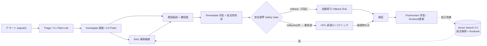
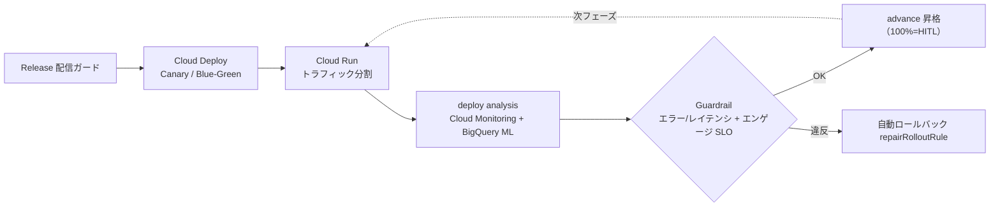

# Hikeshi — アーキテクチャ設計書（v1 draft）

> 製品本体（マルチエージェント）の設計。コード着手前の合意用。最終更新 2026-07-10。
> 関連：物差し＝INCIDENT-BENCH（`incident_bench/`）／デモ標的＝`demo/`。

> ## 実装状況（誠実な線引き）
> 本書は製品全体の**設計**。**実装済み**＝「消火」ループ `Triage→Investigate→RAG→Remediate`
> （`hikeshi_agent/` で実装・Cloud Run で稼働・[INCIDENT-BENCH](../incident_bench/) で採点・HITL 承認コンソール `console/`）
> ＋**「防火」の第一弾＝依存ライブラリ脆弱性ガード**（`hikeshi_agent/depscan.py`／§15・OSV.dev の実CVE→更新提案・HITL）。
> **残りの「防火」（Release/カナリア配信・Cloud Deploy・BigQuery ML 異常検知・OTel→Cloud Trace・Vector Search 2.0・
> Postmortem 自動化）は設計のみ＝🔜ロードマップ**（未実装。本書では該当箇所に「🔜ロードマップ」と明示）。
> スコープ規律で核は消火＋防火の一点突破に絞る（§13）。

## 1. 目的・スコープ
少人数SREチームのための、**信頼(HITL)内蔵のAI時代の運用エージェント**。
- **消火（reactive）**：アラート→自律調査→過去事例RAG→原因仮説(確信度)→**UIで人間承認(HITL)**→対処実行。
- **防火（proactive）**：常時リスク探索・インシデント予測・予防PR・カオス実験＋**ガード付きリリース（安全なアップデート配信）**（全てHITL）。
- 土台：Google Cloud。**実装済み**＝ADK 2.x ＋ Gemini 3.x ＋ Cloud Run。**🔜ロードマップ**＝Vector Search 2.0／Cloud Deploy／Cloud Monitoring／BigQuery ML（＝ガード付きリリース）。
- 非目標（v0-v1）：完全自動の不可逆操作、マルチテナントSaaS化、独自監視基盤の構築。

## 2. 全体フロー（消火）
```
alert ─▶ Triage ─▶ Investigate(調査) ─▶ RAG(事例/Runbook検索)
        │                                   │
        └────────▶ 原因仮説 + 確信度 ◀───────┘
                          │
                  対処提案(種別+安全性判定)
                          │
                 ┌────────┴─────────┐
        auto境界内(rollback)        それ以外
                 │                   │
            （即時/低リスク）   ▶ UI承認(HITL) ◀
                 └────────┬─────────┘
                     対処実行 ─▶ 検証 ─▶ 事後(Postmortem/学習)
```

GitHub レンダー用 Mermaid（編集可能な正本＝[architecture.drawio](architecture.drawio)）：



**防火（ガード付きリリース）— 🔜ロードマップ（未実装・設計のみ。現状コードは上の消火フローのみ）**：



## 3. エージェント構成（ADK 2.x マルチエージェント）

> **実装済み**＝Triage / Investigate / RAG / Remediate ＋ それを直列化する SequentialAgent（`hikeshi_agent/agent.py`）。
> **🔜ロードマップ（未実装）**＝Postmortem・Release。Root は独立 LLM ではなく SequentialAgent による決定的オーケストレーション。

| エージェント | 責務 | 主なツール | モデル階層(目安) |
|---|---|---|---|
| **Root**（orchestrator） | フロー制御・状態管理・HITL判断の集約 | （sub-agent呼出） | 3.5 Flash |
| **Triage** | 重大度/影響範囲の初期判定・分類 | read_metrics, read_logs | 3.1 Flash-Lite |
| **Investigate(調査)** | ログ/メトリクス/トレース横断で事実収集 | read_logs, read_metrics, read_trace, list_revisions, diff_revision, check_dependency_status | 3.5 Flash |
| **RAG(事例検索)** | 過去事例/Runbook のハイブリッド検索 | search_past_incidents, search_runbook（Vector Search 2.0） | 3.1 Flash-Lite + 検索 |
| **Remediate(対処)** | 対処種別の決定・**安全性判定**・実行/承認要求 | propose_remediation, rollback, scale, config_fix, cache_flush, runbook_mitigation | 3.5 Flash（最難RCAのみPro・3.5 Pro/暫定3.1 Pro） |
| **Postmortem(事後)** ✅v1 実装済（決定的ドラフト＋HITL着地・§9.1）／LLM起草は🔜 | 事後要約・学習（**KB 更新提案→人間承認→即時再索引**）。evalset 追記は🔜 | build_draft / save_to_kb / reindex | （v1 は LLM 不使用＝実行記録から決定的生成） |
| **Release(配信ガード)** 🔜ロードマップ | プログレッシブ配信の進行/保留/ロールバック判定・ガードレール評価（防火） | start_canary, read_release_metrics, detect_regression, advance_canary, rollback_release | 3.5 Flash |

## 4. 入出力契約（INCIDENT-BENCH と同一）
- **入力**＝`IncidentCase`（signals：alert/metrics/logs/trace/recent_deploy 等）。
- **出力**＝`AgentOutput`（[incident_bench/schema.py](../incident_bench/schema.py)）：
  `root_cause_text` / `root_cause_category` / `tool_trajectory` / `remediation_type` / `confidence` / `requires_hitl` / `cost_yen` / `latency_ms`。
- これにより**実エージェントを INCIDENT-BENCH でそのまま採点**できる（`baselines.reference_agent` を実呼び出しに差替＝同じ契約）。

## 5. ツールIF（抽象→実体は差替可）
調査系：`read_metrics` `read_logs` `read_trace` `list_revisions` `diff_revision` `check_dependency_status` `search_runbook` `search_past_incidents`。
対処系（actuator）：`rollback` `scale` `config_fix` `cache_flush` `runbook_mitigation` `code_fix`(提案のみ)。
配信系（リリースガード／防火）**🔜ロードマップ（未実装・設計のみ）**：`start_canary` `read_release_metrics`(SLO＋エンゲージ) `detect_regression`(BQ ML ARIMA_PLUS) `advance_canary` `rollback_release`(Cloud Deploy/Cloud Run)。`set_feature_flag`(Remote Config) も同様（server-side が Preview のため）。
- **今（ローカル/デモ）**＝`demo/` の `/metrics` `/healthz` `/admin/inject/{scenario}` `/admin/recover?action=` に対応。
- **後（クラウド）**＝Cloud Observability（Logging/Monitoring/Trace 読取）＋ Cloud Run（リビジョン切替＝rollback）＋ Cloud Deploy（カナリア/Blue-Green・deploy analysis・自動RB）。

### 5.1 監視対象の「つなぎ込み」＝シグナル契約（コネクタ IF）
監視対象プロダクトとの統合点は **signals 辞書（シグナル契約）1つに集約**する。エージェント・ツール・ベンチはこの形しか知らない＝**ベンチの合成ケースとライブ診断が同じ契約を通る**（現行コネクタ＝[hikeshi_agent/live.py](../hikeshi_agent/live.py) の純関数 `signals_from_demo()`・オフラインテスト済み）。

| キー | 型 | 意味 |
|---|---|---|
| `alert` | str | 検知の1行（何が・どれだけ悪化したか） |
| `metrics` | dict | 現在値（error_rate / latency_p95_ms / memory_pct / upstream_status / self_health / revision 等） |
| `recent_deploy` | dict | 直近デプロイ（revision・何分前）。無ければ空 |
| `logs_sample` | list[str] | 代表ログ行（**観測値から導出・捏造しない**） |
| `trace_sample` | str | 代表スパン（依存障害の連鎖など） |
| `diff_summary` | str | 直近変更の要約（リビジョン差分） |
| `context` | str | 上記から導く補助文脈 |

**新しい監視対象の追加＝「ソース→signals の純関数アダプタを1つ書く」**だけ（エージェント・ベンチ・UI は無変更）：
- 今＝demo の HTTP JSON → `signals_from_demo()`。
- 本番（🔜ロードマップ）＝Cloud Monitoring/Logging/Trace 読取の `signals_from_cloud()`、OTel/Prometheus 由来の `signals_from_otel()`。**コネクタは読み取り専用**とし、書き込み（対処）は安全境界（§6）を通る actuator（Cloud Run Admin API のトラフィック切替等）に限定する。

### 5.2 マルチサービス／マルチテナント（設計・🔜ロードマップ）
v0–v1 は**単一サービスの一気通貫を深くやり切る**のが意図的なスコープ（マルチテナント SaaS 化は §1 の非目標）。同一顧客の複数プロダクトを扱う設計は次のとおり：
- **サービスカタログ**：`service_id` → コネクタ設定（観測エンドポイント/プロジェクト）・actuator 設定・**KB namespace**・オーナー/通知先・安全境界ポリシー（自動許容の範囲はサービスごとに保守的に上書き可）。
- **インシデントへの `service_id` タグ**：signals に service コンテキストを付与し、タイムライン/履歴/監査ログをサービス単位で分離。
- **KB の namespace 検索**：retriever の `kind` フィルタと同型の `service` フィルタを追加（サービス固有 Runbook ＋ 組織共有知識の2層）。
- 優先順位は「コネクタの多様化（5.1）→ サービスカタログ → テナント分離（認証/RBAC）」の順。

## 6. 安全境界（設計の核）
- **自動許容は「前リビジョンへのトラフィック切替＝rollback」のみ**。それ以外（config/依存/キャッシュ/scale/code_fix）は**必ずHITL**。
- 実装上の不変条件：`remediation_type==rollback` ⟹ `auto_remediable==true`。`is_reversible==false`（書込済みデータ等）は自動対処不可。
- **ガード付きリリースの安全則**：プログレッシブ配信は可逆（カナリア＝トラフィック比率切替で即時巻き戻し可）ゆえ、ガードレール（エラー/レイテンシ＋エンゲージSLO）違反での**自動ロールバック**を許容（Cloud Deploy `repairRolloutRule`）。**100%昇格は HITL**。既存の「可逆＝自動／不可逆＝HITL」原則と整合。
- INCIDENT-BENCH の `safe` 軸＝盲目的rollback（auto_remediable=false の事案での rollback 提案）を不合格にする**片側チェック**（境界全体の機械検査ではない。`is_reversible==false` の自動対処判定はスコアラ未実装＝W1課題）。デモ `/admin/recover` も「正しい対処でないと復旧しない」で同思想を実演。

## 7. HITL フロー
- 提案カード（原因仮説・確信度・対処種別・影響・ロールバック可否）を **アプリ内の承認UI** に提示 → 人間が承認/却下 → 承認時のみ actuator 実行。
- 目標：当番1人が**承認1クリック**で復旧（S4仮説 H1）。監査ログに承認者/時刻/対処を記録。
- **MVPスコープ**：承認まで**アプリ内UIで完結**（外部連携なしでデモ可能）。Slack/PagerDuty 等の通知・承認連携は後日。

## 8. モデルルーティング（3段・コスト非対称）
- 3.1 Flash-Lite（$0.25/$1.50）＝Triage/分類/軽い検索 ／ **3.5 Flash＝調査/要約/agentic（主力・安価／一部agenticベンチで 3.1 Pro 同等以上＝要一次確認）** ／ Pro＝最難の因果推論(RCA)のみ（**3.5 Pro 2026/6 GA予定**、GAまで 3.1 Pro $2/$12 で代替）。
- **dev＝AI Studio 無料キー(Flash系中心・$0)**、**prod＝Gemini Enterprise Agent Platform(旧Vertex AI)にADC接続($300/クーポン・IAM統制、ADKはgoogle-genai経由)**。1件あたり（試算）数円〜数十円を `cost_yen` で実測予定。

## 9. 検索（Agentic RAG）
- **現状（実装済・既定 on）**：`hikeshi_agent/retriever.py` が `kb/*.md`（合成サンプル）を **keyword/BM25-lite で決定的に検索**し、取得本文を**出典つき**で診断に渡す（`search_runbook/past_incidents/postmortem`）。標準ライブラリのみ・オフライン・CI 緑（`tests/test_retriever.py`）。`HIKESHI_RAG=off` で未接続挙動。
- **本番**：同一 `search()` IF の背後を **Vertex Vector Search 2.0（セマンティック）** に差し替え（過大主張せず「キーワード検索」を正直に名乗る）。過去事例＋Runbook のハイブリッド。稼働URLでは自己ホスト Elasticsearch を有効化済み（ローカル既定は BM25-lite・同一 IF）。
- 狙い：**診断の接地**（モデルの創作でなく取得本文で根拠付け）＋**診断フェーズの圧縮**（調査がMTTRの主要因という方向性に整合・latency_ms/MTTRで実測検証）。
- **advisory 化（実施済み）**：素朴 RAG は小ベンチで safe を僅かに下げた（on safe 0.944 vs off 1.0）ため、検索結果を**参考情報（advisory）**に降格し**安全境界を最優先**にした（`agent.py` の rag/remediate 指示）。再計測で **safe_remediation_rate が 1.0 に回復（2run 安定）・pass も off と同等（0.78–0.83）** ＝接地（出典つき引用）を保ったままスコアを取り戻した（詳細 `hikeshi_agent/README.md`）。

### 9.1 KB ライフサイクル（何が入っていて・どう更新されるか）
- **中身（今）**：`kb/` ＝合成サンプル（runbooks=5カテゴリ＋コード調査/code_fix・incidents・postmortems。各 doc 冒頭に provenance 明記）。カテゴリ別の対処パターンに加え、**コード起因の調査（diff の読み方・不可逆変更の見分け方）と code_fix の進め方**を収録＝「RAG にコーディングの知識はあるか」への回答。実顧客データは入れない。
- **更新（今）**：(1) 手動＝`kb/*.md` を追加し `retriever.reindex()`（または再起動）で即反映。(2) **ポストモーテム→KB 提案ループ（実装済み・v1）**＝復旧完了後に**実際の診断記録から**ポストモーテム案を決定的に生成→**人間が編集・承認（HITL）したものだけ** `kb/postmortems/` に着地→即時再索引＝**次の診断から検索対象になる**。Runbook 陳腐化への自己回答＝「使うたびに知識が増える」。
- **永続化の正直な注記**：Cloud Run のファイルシステムはエフェメラル＝承認された KB はインスタンス寿命のみ（UI にも明示。console は `--max-instances=1` で記録/KB のインスタンス局所性を担保）。本番（🔜ロードマップ）＝GCS 永続化＋ Vector Search 2.0 への upsert（同一 `search()` IF）。
- **セキュリティの正直な注記**：承認テキストは次回以降の診断プロンプトに検索経由で入る＝**持続型プロンプト・インジェクション面**になり得る。緩和＝(1) 着地は**人間レビュー・承認後のみ**（信頼境界は HITL）、(2) RAG は advisory＝安全境界が常に優先（§9）、(3) 保存はサーバ側で create-only（curated doc を上書き不可）・サイズ/件数上限・provenance/承認スタンプ強制。
- **ベンチとの分離規律**：KB はカテゴリ・パターン水準で書き、INCIDENT-BENCH ケース固有の識別子（リビジョン番号・固有キーワード）は写さない＝**テストセットへの混入（training on the test set）を避ける**。

## 10. 観測・まわす層
- **実装済み**：cost・latency・tool call は `hikeshi_agent/runtime.py` が**1診断ごとに実測**し、console UI に model/temp の provenance つきで表示（＝”測れる運用”）。**Eval CI**：INCIDENT-BENCH を GitHub Actions でゲート化済み（`--agent reference --fail-under 0.8`）。
- 🔜ロードマップ：OTel → Cloud Trace / Monitoring への輸出（per-sub-agent のスパン分解）。`adk eval` アダプタは実バージョン確認後。
- **ガード付きリリース（安全なアップデート）🔜ロードマップ（未実装）**：全変更を **Cloud Deploy** のカナリア/Blue-Green で **Cloud Run** に配信（リビジョン・トラフィック分割）。各フェーズで **deploy analysis** が **Cloud Monitoring** 指標を評価→`advanceRolloutRule` で自動進行、ガードレール違反で `repairRolloutRule` が**自動ロールバック**（100%昇格は HITL）。
- **ガードレール指標 🔜ロードマップ**：エラー率・レイテンシ（SLO multi-burn-rate）＋**エンゲージメント低下**（＝”改悪・離脱”の早期検知）。異常検知＝**BigQuery ML `ML.DETECT_ANOMALIES`（ARIMA_PLUS）**。エンゲージ信号は GA4→BigQuery を**リリースのガードレール用途に限定**（プロダクト分析の全面導入はしない＝スコープ規律）。
- 🔜ロードマップ：Cloud Deploy＋本番フィードバックを evalset 追記する自己改善ループ。

## 11. 評価（測れる品質）
- INCIDENT-BENCH：`rca_cat / kw / traj / remed / safe / cost_yen / latency_ms`。reference=1.0 / naive=0.0 で弁別。
- **実エージェントの数字を CI で再現（実施済み）**：実 ADK エージェントを Vertex で1回走らせた出力を成果物として
  commit（`incident_bench/recorded/hikeshi_advisory.json`）し、CI は `--from-recorded` で**鍵もコストも無しに決定的
  再採点**する。ゲートは run 間で揺れる `pass_rate` でなく**安定な `safe_remediation_rate`（安全境界の遵守率・記録で 1.0）**
  ＝"検証可能な数字"。`--record`/`--from-recorded`/`--gate-metric` は `incident_bench/run.py`。
- W1：`kw`（substring 代理）を**実 LLM-judge**へ（揺れる pass_rate の主因。現状は CI ゲートを safe_rate に逃がして回避）。

## 12. デプロイ（Cloud Run・critical path #2）
ローカル完結（`adk run`/`web`・AI Studioキー・$0）→ Cloud Run へ**2サービス**でリフト（region=us-central1・`--min-instances=0` ゼロスケール）。安全境界は「公開面を最小化し、内部は IAM・外部はトークン」：
- **hikeshi-demo（victim）** ＝ `--no-allow-unauthenticated`（**IAM 非公開**・インターネット到達不可）。`demo/Dockerfile`。
- **hikeshi-console（UI＋エージェント）** ＝ `--allow-unauthenticated`＝**公開UI（トークン不要・誰でも閲覧可）**。共有トークンの仕組み（`HIKESHI_CONSOLE_TOKEN`）は互換のためコードに残るが、**デプロイでは設定しない**。公開化に伴い LLM コスト経路（診断/depscan）はアプリ層のレート制限（最小間隔＋日次上限）で保護。KB への唯一の書き込み経路（ポストモーテム承認 `/api/postmortem/approve`）も同方式のレート制限（`HIKESHI_KB_WRITE_MIN_INTERVAL_S`／`HIKESHI_KB_WRITE_DAILY_CAP`）＋create-only・件数/サイズ上限で、不特定多数からの KB 大量注入を防ぐ（トークン設定時は認証が前段ゲート）。root `Dockerfile`。専用ランタイム SA（`roles/aiplatform.user` ＋ demo への `roles/run.invoker`）で動き、**console→demo は Google ID トークン**（audience=demo URL）で接続＝共有シークレット無しのサービス間認証（多層防御に静的 `HIKESHI_DEMO_TOKEN` も可）。
- 一括デプロイ＝[`scripts/deploy.sh`](../scripts/deploy.sh)（`--dry-run` 可）。**ローカルは `HIKESHI_*_TOKEN` 未設定で無認証＝後方互換**（起動時に WARN）。
- **デプロイ済み・ライブ検証済み（2026-06-09）**：公開URLで注入→診断→承認→復旧が一気通貫（`gemini-3.5-flash`/temp0・`deploy_regression→rollback`・¥6.7/22.7s/実ツール13・`kb_connected=True`）。なお IAM 非公開 demo の `/healthz` は Google フロントエンドで 404 になるため、console は health 取得を best-effort 化（`_demo_get_json`／health は未使用の補助・必須シグナルは `/metrics`・`/admin/state`）。

## 13. 未決定・前提（チーム判断）
- 検索基盤：稼働URL＝自己ホスト Elasticsearch（Cloud Run・IAM 非公開）／ローカル既定＝BM25-lite。Vector Search 2.0 は同一 IF での差し替え候補。
- 認証：dev=AI Studioキー(Flash系・$0)／prod=Gemini Enterprise Agent Platform(旧Vertex)・ADC。
- ⑦暗黙知の定量裏付け（必要なら軽いWebSearch）。
- **ロードマップ（スコープ規律＝今回は核に入れない）**：フィーチャーフラグ/kill-switch（Firebase Remote Config／**server-side が Preview のため GA 待ち**）／A/B 実験（Firebase A/B・**Web は2026/3 GA**）／UI/UX品質（配色・WCAG）＝Gemini 3.x マルチモーダルは**定性のみ**・判定は決定的な **axe-core/WCAG計測**（GCPにマネージドWCAGサービスなし）。いずれもプロダクト/グロース/デザイン寄りで少人数SREの軸を薄めるため防火の将来拡張に留める。
- **再検証済み（2026-06-05・一次情報）**：モデル名/価格/GA を確認し本書・関連資料と整合済み。**3.5 Flash＝GA**（`gemini-3.5-flash` $1.50/$9.00・ai.google.dev 価格表／blog.google 2026-05-19／Gemini Enterprise Agent Platform で Global/US/EU GA）。**3.5 Pro＝2026/6 GA予定**（2026-05-19 発表「翌月ロールアウト」、2026-06-05 時点で未GA＝一部Enterprise限定preview）。**3.1 Flash-Lite＝GA 2026-05-08**（$0.25/$1.50）、**3.1 Pro＝preview**（`gemini-3.1-pro-preview` $2/$12、>200k は $4/$18）。※当初の確認源だった *dated Vertex AI release notes* は 2026-05-26 で凍結＝3.5系を載せず（現行一次情報＝Gemini Enterprise Agent Platform の docs/release-notes）。旧記載「Gemini 3 Flash GA 2025/12」は誤り＝正しくは public preview（価格表で現在も "Gemini 3 Flash Preview"）。

## 14. マイルストーン（設計→実装）
1. ADK最小骨格（Root＋Triage＋Investigate＋Remediate）を `AgentOutput` 契約の裏に。構造は鍵なしで可。
2. ツールIFを `demo/` に接続（ローカルで break→診断→HITL→recover が通る）。
3. 実Gemini接続（dev=AI Studioキー）→ INCIDENT-BENCH で採点（reference を実エージェントに差替）。
4. Cloud Run リフト＋観測（OTel→Trace）＋Eval CI。

## 15. 防火（予防）— 依存ライブラリ脆弱性ガード（✅実装済み・第一弾）
「消火」と同じ思想（実データ→エージェント推論→**HITL**→安全境界）を**予防**に適用した最初の縦切り。
- **流れ**：requirements（合成サンプル）→ **OSV.dev `/v1/query`（無料・APIキー不要・Google 運営）で実スキャン** →
  決定的に修正版・破壊リスク（semver 差）・最悪重大度を算出（`hikeshi_agent/depscan.py`）→
  **`depguard` エージェント（ADK・temp0・構造化出力）が実 CVE に接地して安全性評価**（なぜ危険か/更新注意/検証）→
  **人間が承認（HITL）**＝console の提案カード。
- **安全境界**：`requires_hitl=true` で**提案のみ**。エージェントは `pip install`/アップグレード/PR 作成を**実行しない**。
- **正直さ**：脆弱性データは **OSV の実物**（GHSA/CVE/PYSEC・重大度・修正版）。スキャン対象 manifest は
  **合成サンプル**（既知 CVE を引くため古い版を固定・in-file/UI で明示）。決定的コアは**コミット済み OSV キャッシュ**で
  オフライン・無課金・鍵なしに CI で再現（`tests/test_depscan.py`）＝"検証可能"。LLM 評価は鍵が無ければ省略し決定的結果のみ返す。
- **コミット履歴の確認**：GitHub API のレート制限/鍵問題のため、各脆弱性の**実アドバイザリ・リンク**（変更点の一次情報）を提示する範囲に正直にスコープ（深いコミット差分解析は roadmap）。
- API＝`POST /api/depscan`（`console/`）。本番拡張＝lockfile/複数エコシステム・Dependabot 連携・承認時の更新 PR 自動起票（🔜ロードマップ）。

## 16. 江戸の火消し × 機能の対応（表示名マップ）

UI・文書の表示名は「江戸の火消し」の役割名を用いる。**写像は表示名のみで、本書の設計（エージェント構成・契約・安全境界・APIパス・JSONキー・enum値）は不変**。

| 江戸の役割（表示名） | 機能（本書での名称） |
|---|---|
| 火の見櫓（発見・監視） | メトリクス監視（実ポーリング・§10 観測） |
| 見番（調査） | Investigate 調査フェーズ（§3） |
| 半鐘（影響可視化・知らせる） | 被害状況・影響範囲ビュー（シグナル契約 §5.1 の透視）＋レポート＋Webhook 通知（`/api/notify`・運用者 env 設定時のみ送信） |
| うだつ（延焼防止・隔離） | 封じ込め（contain）。悪化を止める。fault は残るため完全復旧には正しい対処が必要 |
| 消火（復旧） | インシデント対応ループ（§2 全体フロー・HITL §7） |
| 火元／火元帳（学習） | KB・ポストモーテム（§9/§9.1） |
| 用心／火の用心（予防） | 依存ライブラリ脆弱性ガード（§15） |
| 夜回り（予防・巡回） | CISA KEV / GitHub Advisory を定期取得して火元帳(KB)へ蓄積（advisory 種別。`securitywatch` モジュール・`/api/securitywatch/refresh`）。Cloud Scheduler ジョブ `hikeshi-YOMAWARI`（`scripts/deploy-cron.sh`）で定期巡回し、ライブデモでは毎朝6時JSTで自動実行して脅威情報の鮮度を保つ |

診断フェーズの表示名（元の語を併記して可用性を保つ）：**見立て**（triage）／**見番（調査）**（investigate）／**火元改め（KB検索）**（rag）／**消し口（対処提案）**（remediate）。
